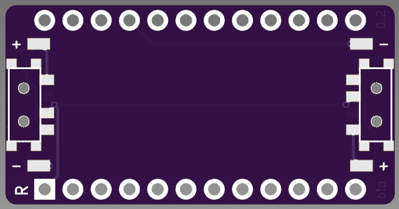

# [Version 2](https://shop.hazel.cc/products/batt-pack)

# batt!pack 0.2

 

A 'backpack' for the nice!nano to make wiring up a battery cleaner on boards without native support

### Bill of Materials
- [1x MSK-12C02](https://www.aliexpress.us/item/2251832670227688.html)
