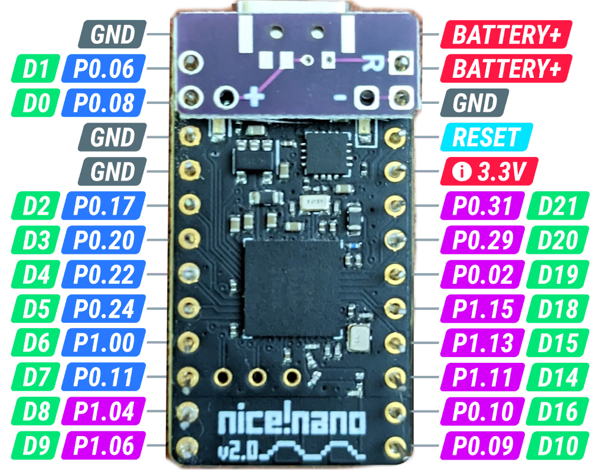

# batt!pack
A 'backpack' for the nice!nano to make wiring up a battery cleaner on boards without native support

### Bill of Materials
- [1x MSK-12C02](https://www.aliexpress.us/item/2251832670227688.html)

_image by sumandrew on discord_

#### Notes
I lost the source files for the most recent version, but do have the gerbers.  Make sure you're downloading `GERBER-battpack-2.zip` for the latest version.
