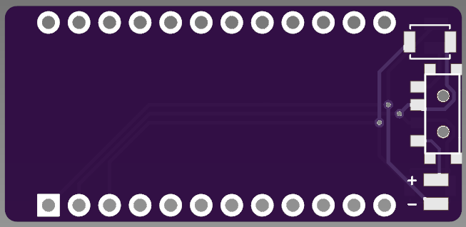
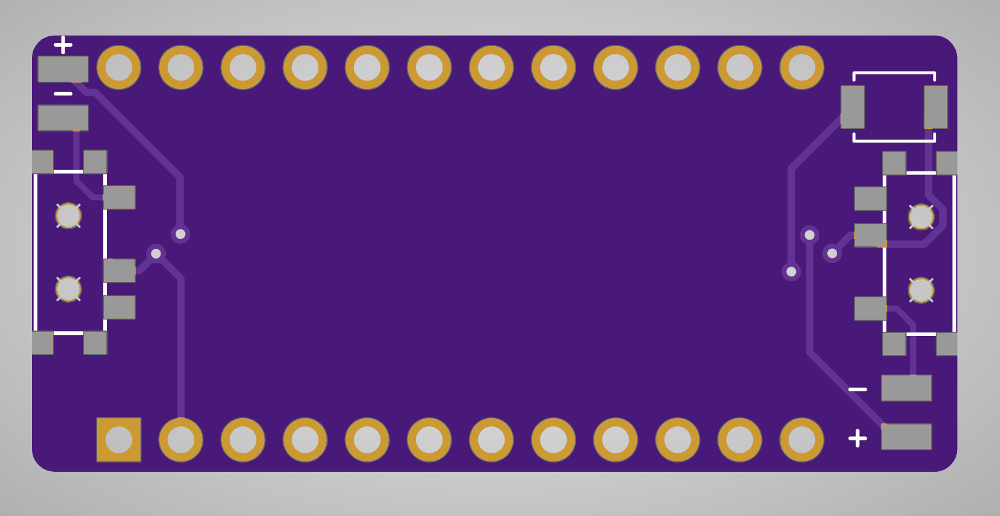

# BattPack
 
 

A 'backpack' for the nice!nano to make wiring up a battery cleaner on boards without native support

## UNTESTED PROTOTYPE

### Bill of Materials
- [1x MSK-12C02](https://www.aliexpress.us/item/2251832670227688.html)
- [1x B3U-1000P](https://www.aliexpress.us/item/3256802081426854.html)

